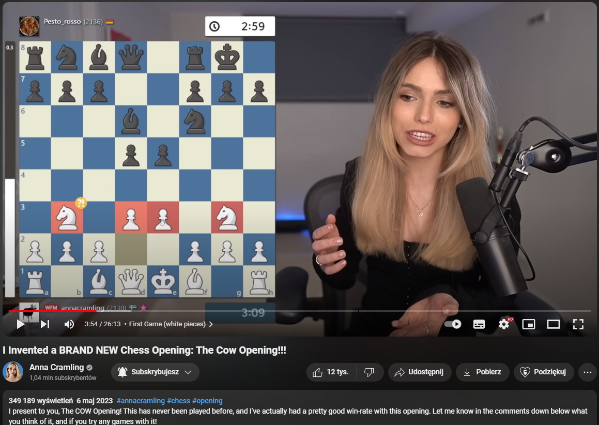

# Początkowe ustawienia

<button id="button_my_init" class="my_button" onclick="hideMy_init()">Pokaż</button>

```{css, echo=FALSE}
.my_button {
  background-color: #caa8b1;
  color: #3c2a34;
  padding: 10px;
  font-size: 14px;
  border: none;
  cursor: pointer;
  width: 70px;
}
h1, h2, h3, h4, h5, h6, p, li {
      text-align: center;
      color: #e0cdd6;
    }
body {
  background-color: #3c2a34;
}
table {
   margin:1em auto;
   color: #e0cdd6;
}
ul {
    text-align: center;
    list-style-position: inside;
}
```
<div id="my_init">

#### Css

```{css, eval=FALSE}
.my_button {
  background-color: #caa8b1;
  color: #3c2a34;
  padding: 10px;
  font-size: 14px;
  border: none;
  cursor: pointer;
  width: 70px;
}
h1, h2, h3, h4, h5, h6 {
      text-align: center;
      color: #e0cdd6;
    }
body {
  background-color: #3c2a34;
}
table {
   margin:1em auto;
   color: #e0cdd6;
}
```

#### Definiowanie ścieżek

```{r setup}
project_path = "D:/moje/projekty/chess-in-the-digital-age"
setwd(paste(project_path,"/presentation", sep = ""))
Dataset_path = paste(project_path,"/Dataset", sep = "")
selected_date = "2024-04"

knitr::opts_chunk$set(root= paste(project_path,"/presentation", sep = ""))
```

#### Definiowanie paczek

```{r message=FALSE}
library(pander)
panderOptions('digits',7)
library(knitr)
library(rvest)
library(stringi)
library(dplyr)
library(scales)
library(ggplot2)
library(png)
library("patchwork") 
library(forcats)
img <- readPNG("../pictures/queens_gambit.png", native = TRUE)
img2 = readPNG("../pictures/candidates_tournament.png", native = TRUE)
img3 = readPNG("../pictures/covid.png", native = TRUE)
img4 = readPNG("../pictures/opening_icon.png", native = TRUE)
```

#### Wybór tablicy do scrapowania

```{r}
url = "https://database.lichess.org"
path= "/html/body/div/div[2]/div/section[1]/table"
wezel = html_node(read_html(url), xpath=path)
```

#### Java-script dla przycisku

```{js, eval=FALSE}
const div_my_init = document.getElementById("my_init");
  div_init.style.display = 'none';
  
var button_my_init = document.getElementById("button_my_init");
  
function hideMy_init() {
  if (div_my_init.style.display === 'none') {
    div_my_init.style.display = 'block';
    button_my_init.innerHTML = "Ukryj";
  } else {
    div_my_init.style.display = 'none';
    button_my_init.innerHTML = "Pokaż";
  }
}
```

</div>

```{js, echo=FALSE}
const div_my_init = document.getElementById("my_init");
  div_my_init.style.display = 'none';
  
var button_my_init = document.getElementById("button_my_init");
  
function hideMy_init() {
  if (div_my_init.style.display === 'none') {
    div_my_init.style.display = 'block';
    button_my_init.innerHTML = "Ukryj";
  } else {
    div_my_init.style.display = 'none';
    button_my_init.innerHTML = "Pokaż";
  }
}
```

# Czy szachy są coraz popularniejsze?


### Scrapowanie danych z lichess

```{r, warning=FALSE}

# wybor tabeli z iloscia zagranych partii wedlug miesiaca
games_count_html = html_table(wezel)[[3]]

my_games_count <- data.frame(count=as.numeric(stri_replace_all(games_count_html,"",regex = "\\,"))[-length(games_count_html)])

# wybor lat do analizy na podstawie linkow .zst.torrent
hyperlinks = html_nodes(wezel, "a")
my_href = html_attr(hyperlinks, "href")
links = data.frame(links = paste(url,my_href,sep="/"))

init_links_for_download = links[seq(2,nrow(links), by=2), 1]

# wyodrebnianie lat z linkow

my_year_from_imported_links = data.frame(year=data.frame(stri_match_all(data.frame(init_links_for_download),
                                   regex = "rated_\\s*(.*?)\\s*[-]"))[,2])


Data_games_count = cbind(my_year_from_imported_links,my_games_count)

# szukanie indeksow rozpoczynajacych nowy rok w zbiorze
first_index_of_years=c()

for(i in unique(my_year_from_imported_links)[,]){
first_index_of_years = append(first_index_of_years,which(rev(Data_games_count$year)==i)[1])
}
```

### Wizualizacja

```{r, warning=FALSE, fig.align='center', fig.height=10, fig.width=10}

my_plot = ggplot(Data_games_count, aes(x = rev(1:nrow(my_games_count)), y = count)) +

  # typ wykresu
  geom_bar(stat = "identity",aes(fill = year)) +
  
  # opis
  labs(x = "Years", y = "Number of chess games", title = "Number of chess games played on the lichess website") +

  # legenda
  scale_fill_manual(name = "Years", values = unique(Data_games_count$year)) +
  expand_limits(x = c(0, NA), y = c(0,NA)) +
  scale_x_continuous(breaks = c(rev(first_index_of_years)),
                     labels = c(rev(unique(my_year_from_imported_links)[,]))) +
  scale_y_continuous(labels = unit_format(unit = "M", scale = 1e-6)) +
  theme(text = element_text(size = 20),
        axis.text.x = element_text(angle = 90, hjust = 1))
my_plot
```

#### Szukanie powodów znacznego wzrostu popularności szachów w 2020 roku

```{r, warning=FALSE, fig.align='center', fig.height=10, fig.width=10}
# strzalka

my_plot + geom_segment(aes(70, 68000000, xend = 86, yend = 62000000),
               linewidth=1.2,
               arrow = arrow(length = unit(5, "mm"))) +
  
  # zdjecia
    inset_element(p = img, 
                left = 0.02, 
                bottom = 0.54, 
                right = 0.42, 
                top = 0.9) +
  inset_element(p = img2, 
                left = 0.05, 
                bottom = 0.29, 
                right = 0.5, 
                top = 0.52)+
  inset_element(p = img3, 
                left = 0.44, 
                bottom = 0.69, 
                right = 0.65, 
                top = 0.82)

```

### Wnioski:

- Szachy zyskują na popularności, ale czy na pewno dzięki internetowi i cyfryzacji?

# Jak wpłynął serial "Gambit królowej" na szachy?

#### Ciekawostka:

- Gambit królowej w szachach to nazwa debiutu szachowego. Debiut szachowy z kolei to początkowe posunięcia w szachach.


*Gambit Królowej*

### Ile było granych debiutów "Gambit królowej"?

# Tworzenie struktury zbioru danych

<button id="my_button" class="my_button" onclick="myFunction()">Pokaż</button>

<div id="tworzenie-struktury">

#### wyodrębnianie tagów oraz hiperłączy

```{r}
hyperlinks = html_nodes(wezel, "a")
my_href = html_attr(hyperlinks, "href")

pander(head(bind_rows(lapply(html_attrs(hyperlinks), function(x) data.frame(as.list(x), stringsAsFactors=FALSE)))))
```

#### Łączenie zmiennych w gotowy do pobrania link

```{r}
links = data.frame(links = paste(url,my_href,sep="/"))
pander(head(links))
```

#### Wybór wersji pobierania (.zst.torrent) w funkcji ograniczającej scrapowanie względem wybranej daty

```{r warning=FALSE}

choose_max_date_to_scrap = function(date){
  
  # co drugi link to .zst.torrent wiec go wyodrebniam
  init_links_for_download = links[seq(2,nrow(links), by=2), 1]
  
  full_date_from_imported_links = data.frame(stri_match_all(data.frame(init_links_for_download),
                                     regex = "rated_\\s*(.*?)\\s*[.]"))[,2]
  
  date_location = which(stri_detect(full_date_from_imported_links, regex = date) == TRUE) 
  
  my_links_for_download = init_links_for_download[c(date_location:length(init_links_for_download))]
  
  return(my_links_for_download)
}

links_for_download = choose_max_date_to_scrap(selected_date)
pander(data.frame(prepared_links = head(links_for_download)))
```

#### Wyodrębianie daty ze scrapowania

```{r warning=FALSE}
full_date_from_imported_links = data.frame(stri_match_all(data.frame(links_for_download),
                                     regex = "rated_\\s*(.*?)\\s*[.]"))[,2]
pander(head(data.frame(full_date_from_imported_links)))
```

#### Wyodrębianie roku, miesięcy, nazw miesięcy ze scrapowania

```{r warning=FALSE}
year_from_imported_links = data.frame(stri_match_all(data.frame(links_for_download),
                                     regex = "rated_\\s*(.*?)\\s*[-]"))[,2]
pander(head(data.frame(year_from_imported_links)))

month_from_imported_links = data.frame(stri_match_all(data.frame(links_for_download),
                                     regex = "-\\s*(.*?)\\s*[.]"))[,2]
pander(head(data.frame(month_from_imported_links)))

my_month_names = month.abb[as.integer(month_from_imported_links)]
pander(head(data.frame(my_month_names)))
```

#### Tworzenie struktury plików - lata

```{r}
my_paths_year <- unique(paste(Dataset_path,"/",year_from_imported_links, sep=""))
pander(data.frame(my_paths_year))

create_folders_year = function(){
  for(i in 1:length(my_paths_year)){
    dir.create(my_paths_year[i])
  }
}
```

#### Tworzenie struktury plików - miesiące

```{r}
my_paths_month <- paste(Dataset_path,"/",year_from_imported_links,"/",month_from_imported_links,". ",my_month_names, sep="")
pander(head(data.frame(my_paths_month)))

create_folders_month = function(){
  for(i in 1:length(my_paths_month)){
    dir.create(my_paths_month[i])
  }
}

```

#### Definiowanie ścieżek do których będą pobierane pliki i definiowanie ich docelowych nazw

```{r}
my_paths = paste(Dataset_path,"/",year_from_imported_links,"/",month_from_imported_links,". ",my_month_names,"/lichess_db_standard_rated_",full_date_from_imported_links,".pgn.zst.torrent", sep="")
pander(head(data.frame(my_paths)))


downloading = function(){
  create_folders_year()
  create_folders_month()
  for(j in 1:length(my_paths)){
    download.file(links_for_download[j], my_paths[j], mode="wb",Sys.sleep(0.2))
  }
}
```

#### Tworzenie struktury plikow i pobieranie w niej zbiorów danych

```{r warning=FALSE,eval=FALSE}
downloading()

```

#### Java-script dla przycisku

```{js eval=FALSE}
const my_div1 = document.getElementById("tworzenie-struktury");
  my_div1.style.display = 'none';
  
var button = document.getElementById("my_button");
  
function myFunction() {
  if (my_div1.style.display === 'none') {
    my_div1.style.display = 'block';
    button.innerHTML = "Ukryj";
  } else {
    my_div1.style.display = 'none';
    button.innerHTML = "Pokaż";
  }
}
```

</div>

```{js, echo=FALSE}
const my_div1 = document.getElementById("tworzenie-struktury");
  my_div1.style.display = 'none';
  
var button = document.getElementById("my_button");
  
function myFunction() {
  if (my_div1.style.display === 'none') {
    my_div1.style.display = 'block';
    button.innerHTML = "Ukryj";
  } else {
    my_div1.style.display = 'none';
    button.innerHTML = "Pokaż";
  }
}
```

# Przygotowywanie zbiorów danych do użycia 

<button id="my_button2" class="my_button" onclick="myFunction2()">Pokaż</button>

<div id="przygotowywanie-zbiorow">

#### Pobieranie informacji o liczbie partii poprzez scrapowanie oraz ograniczenie tego scrapowania względem wybranej daty

```{r warning=FALSE}

choose_max_date_to_scrap_game_count = function(date){
  # wybor tabeli do analizy
  my_games_count = html_table(wezel)[[3]]
  
  # wybor lat do analizy na podstawie linkow .zst.torrent
  init_links_for_download = links[seq(2,nrow(links), by=2), 1]
  
  # wyodrebnianie dat z linkow
  full_date_from_imported_links = data.frame(stri_match_all(data.frame(init_links_for_download),
                                     regex = "rated_\\s*(.*?)\\s*[.]"))[,2]
  
  # szukanie indeksow z datami odpowiadajacymi wybranej dacie
  date_location = which(stri_detect(full_date_from_imported_links, regex = date) == TRUE) 
  
  # wyswietlanie liczb gier dla wybranych dat
  games_count = my_games_count[c(date_location:length(init_links_for_download))]
  
  return(games_count)
}

games_count = choose_max_date_to_scrap_game_count(selected_date)
pander(head(data.frame(games_count)))

```

#### funkcja do ograniczania danych dla konkretnego zbioru względem miesiąca

```{r warning=FALSE}

preparing_month_dataset = function(date, data_size = 0.001){
  
  # szukanie indeksu wybranej daty
  searching_location = which(stri_detect(full_date_from_imported_links, regex = date) == TRUE) 
  
  # szukanie liczby meczy dla wybranej daty i ograniczanie jej wzgledem wyszukanych wartosci
  decreasing_game_number <- round((as.numeric(stri_replace_all(games_count,"",regex = "\\,"))*18*data_size)[searching_location])
  
  # definiowanie pliku do przerobki na podstawie wybranej daty
  pgn_file_to_read = paste(Dataset_path,"/",year_from_imported_links,"/",month_from_imported_links,". ",my_month_names,"/lichess_db_standard_rated_",full_date_from_imported_links,".pgn", sep="")[searching_location]
  
  # wczytanie pliku do zdefiniowanej dlugosci
  my_pgn <- read.table(pgn_file_to_read,
                   quote="", sep="\n", stringsAsFactors=FALSE, nrows = decreasing_game_number)
  
  # szukanie ostatnich 22 nazw kolumn
  colnms <- sub("\\[(\\w+).+", "\\1", my_pgn[(decreasing_game_number-22):decreasing_game_number,1])
  
  # szukanie indeksow rozpoczynajacych nowe partie
  Event_location = which(stri_detect(colnms, regex = "Event") == TRUE) 
  
  # usuwanie danych pod wyszukanym indeksie
  my_pgn2 = my_pgn[1:(decreasing_game_number-22+Event_location-2),]
  
  # zapis przetworzonego zbioru do pliku
  pgn_file_to_write = paste(Dataset_path,"/",year_from_imported_links,"/",month_from_imported_links,". ",my_month_names,"/Data_",date,".pgn", sep="")[searching_location]
  
  write.table(my_pgn2,pgn_file_to_write,col.names = FALSE,row.names = FALSE,quote = FALSE)
  
  test_path = paste(Dataset_path,"/",year_from_imported_links,"/",month_from_imported_links,". ",my_month_names,"/Data_",date,".pgn", sep="")[searching_location]
  
  # tworzenie pliku dla statusu pracy
  file_txt_for_info = paste(Dataset_path,"/",year_from_imported_links,"/",month_from_imported_links,". ",my_month_names,"/ograniczono_dane.txt", sep="")[searching_location]
  
  write.table(" ",file_txt_for_info)
  
  testing_last_char <- read.table(test_path,
                   quote="", sep="\n", stringsAsFactors=FALSE)
  return(tail(testing_last_char))
}
```

#### funkcja do usuwania oryginalnego zbioru danych względem miesiąca

```{r}
removing_oryginal_dataset = function(date){
  # szukanie indeksu wybranej daty
  searching_location = which(stri_detect(full_date_from_imported_links, regex = date) == TRUE) 
  
  # definiowanie plikow do usuniecia
  file_pgn_zst_to_remove = paste(Dataset_path,"/",year_from_imported_links,"/",month_from_imported_links,". ",my_month_names,"/lichess_db_standard_rated_",full_date_from_imported_links,".pgn.zst", sep="")[searching_location]
  
  file_pgn_to_remove = paste(Dataset_path,"/",year_from_imported_links,"/",month_from_imported_links,". ",my_month_names,"/lichess_db_standard_rated_",full_date_from_imported_links,".pgn", sep="")[searching_location]
  
  # tworzenie pliku dla statusu pracy
  file_txt_for_info = paste(Dataset_path,"/",year_from_imported_links,"/",month_from_imported_links,". ",my_month_names,"/usunieto_oryginal.txt", sep="")[searching_location]
  
  file.remove(file_pgn_zst_to_remove)
  
  file.remove(file_pgn_to_remove)
  
  write.table(" ",file_txt_for_info)
}
```

#### Wywoływanie funkcji przygotowującej zbiór z konkretnego miesiąca do późniejszej analizy

```{r eval=FALSE}
preparing_month_dataset("2013-01")

removing_oryginal_dataset("2013-01")
```

#### Java-script dla przycisku

```{js eval=FALSE}
const my_div2 = document.getElementById("przygotowywanie-zbiorow");
  my_div2.style.display = 'none';
  
var button2 = document.getElementById("my_button2");
  
function myFunction2() {
  if (my_div2.style.display === 'none') {
    my_div2.style.display = 'block';
    button2.innerHTML = "Ukryj kod";
  } else {
    my_div2.style.display = 'none';
    button2.innerHTML = "Pokaż kod";
  }
}
```

</div>

```{js, echo=FALSE}
const my_div2 = document.getElementById("przygotowywanie-zbiorow");
  my_div2.style.display = 'none';
  
var button2 = document.getElementById("my_button2");
  
function myFunction2() {
  if (my_div2.style.display === 'none') {
    my_div2.style.display = 'block';
    button2.innerHTML = "Ukryj";
  } else {
    my_div2.style.display = 'none';
    button2.innerHTML = "Pokaż";
  }
}
```
### Liczenie zagranych debiutów "Gambit królowej" na przestrzeni lat

```{r eval=FALSE}
# komenda szukajaca powtarzalnosc danej kolumny
# zmienne = fct_count(fct_infreq(sub("\\[(\\w+).+", "\\1", pgn[1:nrow(pgn.df),1])))

files_to_read = paste(Dataset_path,"/",year_from_imported_links,"/",month_from_imported_links,". ",my_month_names,"/Data_",full_date_from_imported_links,".pgn", sep="")

Percent_games_count=c()

for(i in 1:length(files_to_read)){
  pgn <- read.table(files_to_read[i], quote="", sep="\n", stringsAsFactors=FALSE)
  
  pgn.df <- data.frame(matrix(sub("\\[\\w+ \\\"(.+)\\\"\\]", "\\1", pgn[,1]),
                              byrow=TRUE, ncol=1))
  
  opening_index = which(sub("\\[(\\w+).+", "\\1", pgn[1:nrow(pgn.df),1]) == "Opening")
  
  All_games_count = length(pgn.df[opening_index,])
  
  Queens_Gambit_games_count = length(which(stri_detect(pgn.df[opening_index,], regex = "Queen's Gambit") == TRUE))

  Percent_games_count = append(Percent_games_count,(Queens_Gambit_games_count/All_games_count)*100)
}

```

```{r echo=FALSE}
 Percent_games_count = c(3.555789, 3.648949, 3.570493, 3.821276, 3.636026, 3.761956, 3.568643, 3.762852, 3.811248, 3.704170, 3.826924, 3.728556, 3.733171, 3.874278, 3.791296, 3.897061, 3.932163, 3.990679, 3.894168, 3.704410, 3.910138, 3.740654, 3.836014, 3.831074, 3.944379, 3.734768, 4.100811, 4.001528, 3.923190, 3.852162, 3.812260, 3.862222, 3.741322, 3.910651, 4.068367, 3.799525, 3.843903, 4.138276, 4.188563, 4.293530, 4.237440, 4.159315, 3.753013, 3.959507, 4.073788, 4.237877, 4.408564, 4.328597, 4.197038, 4.549876, 4.596107, 4.527963, 4.383176, 4.326375, 4.389134, 4.297731, 4.494321, 4.270512, 4.215305, 4.583014, 4.476366, 4.642621, 4.546481, 4.213044, 4.594603, 4.405404, 4.480504, 4.459736, 4.672030, 4.601140, 4.460453, 4.885446, 4.653620, 4.283625, 4.748503, 4.638715, 4.286106, 3.798334, 4.236134, 4.805379, 4.410191, 4.439700, 4.317269, 4.539234, 4.043887, 3.942006, 4.545455, 4.015328, 4.167059, 4.658902, 4.353423, 4.620204, 4.471879, 3.755137, 4.391304, 4.200600, 4.519520, 4.448535, 4.028394, 4.985063, 4.776183, 4.582611, 5.210788, 4.666458, 3.975535, 3.119333, 6.493506, 5.742821, 3.079980, 4.823848, 3.976261, 3.325416, 6.114398, 4.267844, 4.807692, 4.099822, 5.179982, 3.480475, 3.792784, 3.631011, 6.476400, 5.022321, 4.241645, 3.694268, 6.615385, 4.021938, 3.896104, 5.205479, 3.835616, 7.598784, 2.380952, 6.965174, 3.389831, 6.179775, 6.521739, 5.147059)
```

### Przewidywania: 

- Skoro termin "Gambit królowej" zyskał rozgłos dzięki serialowi, to debiut o tej nazwie powinien występować częściej po 2020 roku procentowo w stosunku do całości.

### Wizualizacja

```{r, warning=FALSE, fig.align='center', fig.height=10, fig.width=10}

my_Percent_games_count <- data.frame(count=Percent_games_count)

Data_Queens_gambit_games_count = cbind(data.frame(year=year_from_imported_links),my_Percent_games_count)

ggplot(Data_Queens_gambit_games_count, aes(x = rev(1:length(games_count)), y = count)) +

  # typ wykresu
  geom_bar(stat = "identity",aes(fill = year)) +
  
  # opis
  labs(x = "Years", y = "Number of chess games ( % ) ", title = "Number of 'Queen's Gambit' openings played") +

  # legenda
  scale_fill_manual(name = "Years", values = unique(Data_Queens_gambit_games_count$year)) +
  expand_limits(x = c(0, NA), y = c(0,NA)) +
  scale_x_continuous(breaks = c(rev(first_index_of_years)),
                     labels = c(rev(unique(year_from_imported_links)))) +
  scale_y_continuous(labels = unit_format(unit = "%", scale = 1)) +
  theme(text = element_text(size = 20),
        axis.text.x = element_text(angle = 90, hjust = 1)) 
```

### Obserwacje:

- Widać wyraźnie malejący stosunek granych debiutów "Gambit królowej", po dacie premiery serialu.

### Wnioski:

- Serial znacząco wpłynął na osoby, które nie wiedzą co znaczy termin "Gambit królowej".

# Czy serial wpłynął tylko na nowicjuszy szachowych?

### Wyszukiwanie Ilości zagranych partii przez nowicjuszy (ranga < 1200)

```{r eval=FALSE}
files_to_read = paste(Dataset_path,"/",year_from_imported_links,"/",month_from_imported_links,". ",my_month_names,"/Data_",full_date_from_imported_links,".pgn", sep="")

novice_games_count=c()

for(i in 1:length(files_to_read)){
  pgn <- read.table(files_to_read[i], quote="", sep="\n", stringsAsFactors=FALSE)
  
  pgn.df <- data.frame(matrix(sub("\\[\\w+ \\\"(.+)\\\"\\]", "\\1", pgn[,1]),
                              byrow=TRUE, ncol=1))
  
  elo_index = which(sub("\\[(\\w+).+", "\\1", pgn[1:nrow(pgn.df),1]) == "WhiteElo")
  
  All_games_count = length(pgn.df[elo_index,])
  
  my_novice_games_count = length(which(as.numeric(pgn.df[elo_index,]) < 1200) == TRUE)

  novice_games_count = append(novice_games_count,(my_novice_games_count/All_games_count)*100)
}

```

```{r echo=FALSE}
Percent_novice_games_count = c(12.857987, 13.357555, 14.015549, 12.922200, 14.467707, 13.384027, 13.837187, 14.234658, 14.232338, 14.788341, 14.934010, 15.014064, 16.897613, 17.026115, 16.269454, 14.236539, 14.869463, 13.552847, 13.865011, 13.463545, 12.501214, 13.284646, 12.647089, 12.379299, 13.009109, 13.156219, 13.002317, 11.689088, 11.780033, 11.733358,
12.335052, 13.061396, 11.917121, 12.768498, 13.461747, 14.802892, 14.781213, 15.105308, 14.372718, 13.829721, 13.277386,  9.479606,  9.801503,  9.196180,  8.945781,  9.250145,  8.852692,  8.368533,  8.232704,  9.245650, 9.742563 ,  9.900376, 10.526435, 10.628750, 11.628482, 12.295459, 13.466619, 13.956875, 15.711591, 16.341540, 16.761042, 15.867550, 16.370554, 14.602462, 14.755992, 12.741608, 12.044886, 12.451548, 11.412659, 11.158594, 11.841910, 10.937427, 10.494541, 10.449592, 10.402702,  8.965210,  8.133735,  7.652617,  6.759650,  6.036801, 6.386926 ,  6.118392,  6.858202,  5.383212,  6.536050,  6.708464,  5.287035,  3.765412,  3.884227,  2.384914,  2.106495,  2.505873,  2.167353,  1.799632,  2.289855,  2.714674,  2.927928,  2.853198,  3.389530,  3.080657,  2.998501,  2.700025,  3.770621,  4.040088,  5.062861,  4.969169,  5.614973,  4.119850,  4.421262,  4.336043,  4.747774,  3.919240,  3.090072,  2.796174,  2.804487,  4.010695,  3.863038,  4.668930,  2.960222,  3.042198,  2.854007,  4.575893,  2.570694,  5.095541,  5.230769,  3.656307,  1.298701,  2.465753,  4.383562,  2.127660,  5.555556,  2.487562,  3.389831,  1.685393,  1.449275,  2.205882)
```

### Wizualizacja

```{r, warning=FALSE, fig.align='center', fig.height=10, fig.width=10}

my_Percent_novice_games_count <- data.frame(count=Percent_novice_games_count)

Data_novice_games_count = cbind(data.frame(year=year_from_imported_links),my_Percent_novice_games_count)

ggplot(Data_novice_games_count, aes(x = rev(1:length(games_count)), y = count)) +

  # typ wykresu
  geom_bar(stat = "identity",aes(fill = year)) +
  
  # opis
  labs(x = "Years", y = "Number of chess games ( % ) ", title = "Number of novice games (rank < 1200) ") +

  # legenda
  scale_fill_manual(name = "Years", values = unique(Data_novice_games_count$year)) +
  expand_limits(x = c(0, NA), y = c(0,NA)) +
  scale_x_continuous(breaks = c(rev(first_index_of_years)),
                     labels = c(rev(unique(year_from_imported_links)))) +
  scale_y_continuous(labels = unit_format(unit = "%", scale = 1)) +
  theme(text = element_text(size = 20),
        axis.text.x = element_text(angle = 90, hjust = 1))  +
  
  # strzalka
  geom_segment(aes(58, 10.68, xend = 95, yend = 10),
               linewidth=1.2,
               arrow = arrow(length = unit(5, "mm"))) +
  
  # zdjecia
    inset_element(p = img, 
                left = 0.02, 
                bottom = 0.54, 
                right = 0.42, 
                top = 0.9)
```

### Obserwacje:

- Widać znaczny napływ nowicjuszy po dacie premiery serialu

#  

- Po oglądnięciu serialu, osoby nie znające się na szachach, chcą poprostu zagrać w tą gre i nie interesują się debiutami. To powoduje chęć zagrania na stronie lichess jako nowicjusz.

### Wyszukiwanie Ilości zagranych partii przez zaawansowanych graczy (ranga > 1800)

```{r eval=FALSE}
files_to_read = paste(Dataset_path,"/",year_from_imported_links,"/",month_from_imported_links,". ",my_month_names,"/Data_",full_date_from_imported_links,".pgn", sep="")

pro_games_count=c()

for(i in 1:length(files_to_read)){
  pgn <- read.table(files_to_read[i], quote="", sep="\n", stringsAsFactors=FALSE)
  
  pgn.df <- data.frame(matrix(sub("\\[\\w+ \\\"(.+)\\\"\\]", "\\1", pgn[,1]),
                              byrow=TRUE, ncol=1))
  
  elo_index_v2 = which(sub("\\[(\\w+).+", "\\1", pgn[1:nrow(pgn.df),1]) == "WhiteElo")
  
  All_games_count_v2 = length(pgn.df[elo_index_v2,])
  
  my_pro_games_count = length(which(as.numeric(pgn.df[elo_index_v2,]) > 1800) == TRUE)

  pro_games_count = append(pro_games_count,(my_pro_games_count/All_games_count_v2)*100)
}

```

```{r echo=FALSE}
Percent_pro_games_count = c(37.40147, 36.87683, 36.60574, 38.37548, 35.97002, 36.33163, 36.39784, 35.59684, 35.33367, 34.72095, 34.12763, 34.67730, 31.71130, 31.89369, 32.38043, 35.26457, 33.66681, 35.29768, 34.61231, 35.68552, 36.63676, 35.92310, 36.41645, 36.75703, 36.69145, 36.86464, 36.51448, 38.99629, 38.19485, 39.03156, 37.93636, 37.18610, 38.88070, 37.59239, 35.81443, 33.23792, 34.37311, 32.78103, 34.30681, 33.27068, 32.28600, 37.09628, 34.91706, 35.26478, 39.45290, 36.79776, 37.93584, 40.49999, 41.11839, 36.73043, 36.05931, 36.54866, 34.53625, 33.16309, 30.71899, 30.19501, 27.58696, 26.35116, 23.28145, 22.44087, 21.38344, 23.07251, 21.94241, 23.95264, 22.80938, 24.74834, 24.59433, 24.74195, 25.39781, 24.67711, 25.09992, 26.04638, 25.42134, 28.50875, 26.50054, 29.07127, 27.17457, 28.03059, 28.18683, 27.86270, 29.07300, 28.33898, 28.18196, 29.37956, 29.19279, 30.28997, 31.17257, 36.32123, 31.23409, 39.13478, 36.79345, 37.32707, 42.48285, 39.84696, 40.28986, 43.90627, 39.36937, 42.13836, 38.29636, 39.95519, 36.04626, 36.63612, 31.18617, 28.68775, 28.20251, 23.46754, 25.13369, 21.38993, 21.31148, 21.68022, 23.32344, 26.60333, 20.05260, 19.72038, 23.31731, 24.50980, 25.28534, 16.46859, 22.10916, 30.52012, 21.40505, 16.29464, 20.56555, 24.33121, 18.92308, 20.10969, 18.39827, 29.31507, 25.20548, 15.50152, 11.90476, 12.43781, 24.29379, 22.47191, 13.04348, 22.79412)
```

### Wizualizacja

```{r, warning=FALSE, fig.align='center', fig.height=10, fig.width=10}

my_Percent_pro_games_count <- data.frame(count=Percent_pro_games_count)

Data_pro_games_count = cbind(data.frame(year=year_from_imported_links),my_Percent_pro_games_count)

ggplot(Data_pro_games_count, aes(x = rev(1:length(games_count)), y = count)) +

  # typ wykresu
  geom_bar(stat = "identity",aes(fill = year)) +
  
  # opis
  labs(x = "Years", y = "Number of chess games ( % ) ", title = "Number of pro games (rank > 1800) ") +

  # legenda
  scale_fill_manual(name = "Years", values = unique(Data_pro_games_count$year)) +
  expand_limits(x = c(0, NA), y = c(0,NA)) +
  scale_x_continuous(breaks = c(rev(first_index_of_years)),
                     labels = c(rev(unique(year_from_imported_links)))) +
  scale_y_continuous(labels = unit_format(unit = "%", scale = 1)) +
  theme(text = element_text(size = 20),
        axis.text.x = element_text(angle = 90, hjust = 1))  +
  
  # strzalka
  geom_segment(aes(65, 38, xend = 86, yend = 37),
               linewidth=1.2,
               arrow = arrow(length = unit(5, "mm"))) +
  inset_element(p = img3, 
                left = 0.39, 
                bottom = 0.84, 
                right = 0.6, 
                top = 0.97)
```

### Obserwacje:

- Widać spadek ilości zaawansowanych graczy po 2020 roku w stosunku do całości

### Wnioski:

- Serial wpłynął na popularyzacje szachów, głównie zachęcając do gry nowicjuszy. 

# Dla czego serial nie wpłynął na zaawansowanych graczy?

- Nie zawierał dla nich nic nowego

# Czy dodanie do szachów nowości zwiększy popularność wśród zaawansowanych graczy?

#### Tworzenie nowego debiutu



#### Statystyki popularności Anny Cramling na twitch


#### Wyszukiwanie debiutów po sekwencji posunięć, zamiast po nazwie

```{r eval=FALSE}

#files_to_read = paste(Dataset_path,"/",year_from_imported_links,"/",month_from_imported_links,". ",my_month_names,"/Data_",full_date_from_imported_links,".pgn", sep="")

search_by_moves = function(searching_moves){
  opening_count=c()
  
  for(i in 1:length(files_to_read)){
    pgn <- read.table(files_to_read[i], quote="", sep="\n", stringsAsFactors=FALSE)
    
    moves = which(sub("\\[(\\b+).+", "\\1", pgn[1:nrow(pgn),1]) != "")
    
    All_games_count = length(pgn[moves,])
    
    for(j in 1:length(searching_moves)){
      my_regex = paste("(.*?)\\s*",j,". (\\w+).+", sep = "")
      moves_to_compare = sub(my_regex, "\\2", pgn[moves,])
      moves = moves[which(moves_to_compare == searching_moves[j])]
    }
  
    opening_count = append(opening_count,(length(moves)/All_games_count)*100)
  }
  return(opening_count)
}

search_by_moves(c("e3","d3","Ne2","Nd2","Ng3"))
```

```{r echo=FALSE}
opening_count= c(9, 4, 3, 3, 3, 2, 2, 0, 9, 6, 8, 0, 2, 0, 0, 0, 0, 0, 0, 0, 0, 2, 0, 0, 0, 0, 4, 0, 0, 0, 0, 1, 0, 0, 0, 0, 0, 0, 0, 0, 0, 0, 1, 0, 1, 0, 0, 0, 0, 0, 0, 0, 0, 0, 0, 0, 0, 0, 0, 0, 0, 0, 0, 0, 0, 0, 0, 0, 1, 0, 2, 0, 0, 1, 0, 0, 0, 0, 1, 1, 0, 2, 7, 0, 0, 0, 0, 0, 0, 0, 0, 0, 0, 0, 0, 3, 1, 0, 0, 0, 0, 0, 0, 0, 0, 0, 0, 0, 0, 0, 0, 0, 0, 0, 0, 0, 0, 0, 0, 0, 0, 0, 0, 0, 0, 0, 0, 0, 0, 0, 0, 0, 0, 0, 0, 0)
```

### Wizualizacja

```{r, warning=FALSE, fig.align='center', fig.height=10, fig.width=10}

my_opening_count <- data.frame(count=opening_count)

Data_opening_count = cbind(data.frame(year=year_from_imported_links),my_opening_count)

ggplot(Data_opening_count, aes(x = rev(1:length(games_count)), y = count)) +

  # typ wykresu
  geom_bar(stat = "identity",aes(fill = year)) +
  
  # opis
  labs(x = "Years", y = "Number of chess games", title = "Number of 'Cow' move sequences played") +

  # legenda
  scale_fill_manual(name = "Years", values = unique(Data_opening_count$year)) +
  expand_limits(x = c(0, NA), y = c(0, 10)) +
  scale_x_continuous(breaks = c(rev(first_index_of_years)),
                     labels = c(rev(unique(year_from_imported_links)))) +
  theme(text = element_text(size = 20),
        axis.text.x = element_text(angle = 90, hjust = 1))  +
  
  # strzalka
  geom_segment(aes(80, 3.2, xend = 123, yend = 2.2),
               linewidth=1.2,
               arrow = arrow(length = unit(5, "mm"))) +
  inset_element(p = img4, 
                left = 0.42, 
                bottom = 0.34, 
                right = 0.75, 
                top = 0.51)
```

### Obserwacje:

- Widać wzrost popularności streamerki po opublikowaniu nowego debiutu oraz widać wzrost zainteresowania jej stworzoną sekwencją szachową

### Wnioski:

- Ciężko wpłynąć na zaawansowanych graczy. Rolą internetu jest to zmienić.

# Podsumowanie

- Internet i media społecznościowe znacząco wpływają na popularyzacje szachów. Na graczy

<!-- Są jednak gracze na któych można wpływa -->

<!-- Są jednak grupy i każda wymaga innych środków, by na nie wpłynąć. -->

<!-- # -->

<!-- - Są jednak poszczególne grupy, na które można wpłynąć tylko konkretnymi działaniami. -->
